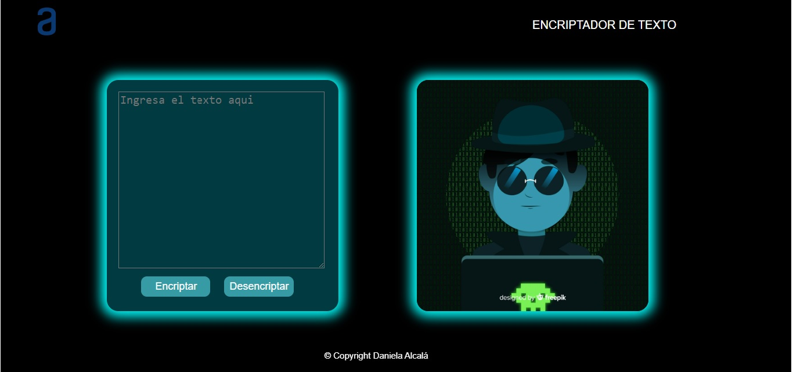
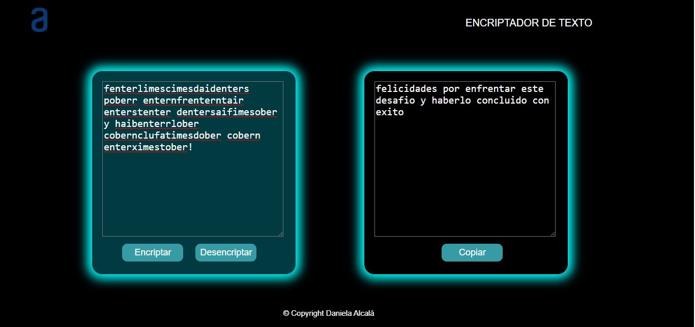

# challengeOne: Encriptador de Texto

* Link proyecto: [Ir al Sitio](https://danielaalcaladaboin.github.io/challengeOneEncriptador/)

## Índice
* [1. Preámbulo](#1-preámbulo)
* [2. Imágenes del proyecto terminado](#6-imágenes-del-proyecto-terminado)

## 1. Preámbulo

Aplicación que encripta textos, que permitirá intercambiar mensajes secretos con otras personas que sepan el secreto de la encriptación utilizada.

## 2. Imágenes del proyecto terminado

  
  
  Ejemplo de la desencriptación de un texto:
  
  
